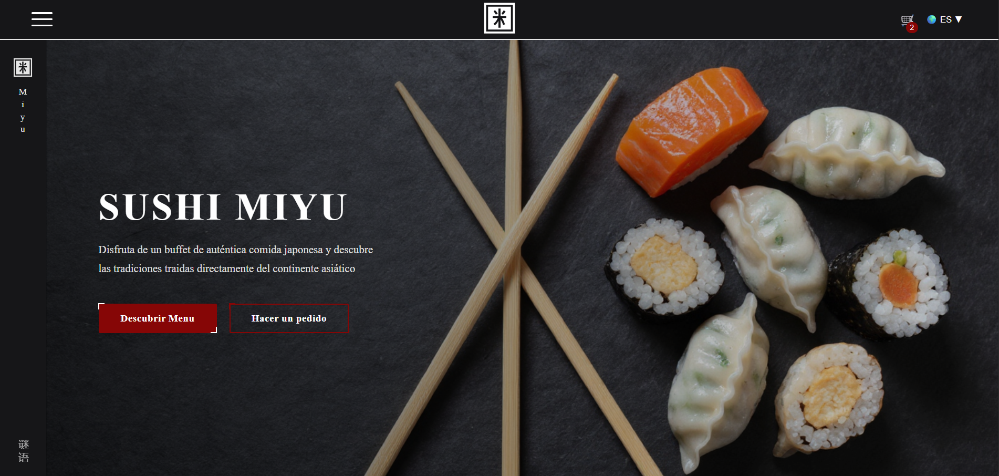
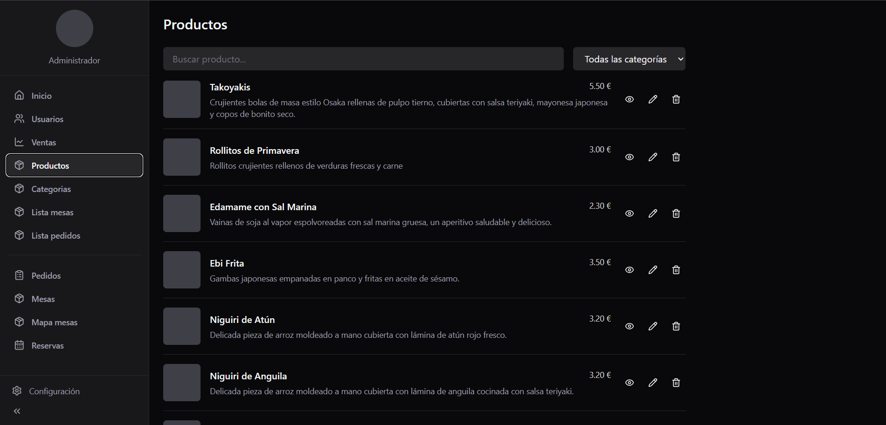
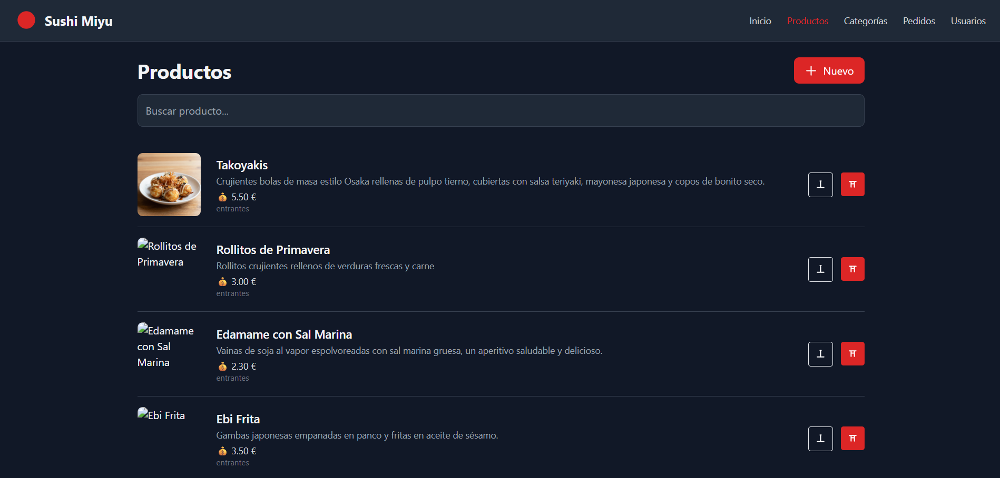

# Sushi Miyu - Proyecto completo

## Índice

- [Descripción del proyecto](#descripción-del-proyecto)
- [Equipo](#equipo)
- [Estructura del proyecto](#estructura-del-proyecto)
- [Partes del proyecto](#partes-del-proyecto)
  - [Frontend Angular](#frontend-angular)
  - [Frontend React](#frontend-react)
  - [Backend Laravel](#backend-laravel)
  - [Despliegue](#despliegue)
- [Ramas y commits](#ramas-y-commits)
- [Comandos para ejecutar](#comandos-para-ejecutar)
- [Diseño y diagramas](#diseño-y-diagramas)

## Descripción del proyecto

Sushi Miyu es una aplicación web para un restaurante asiático. Este trabajo constituye nuestro Proyecto de Fin de Grado (TFG) de Desarrollo de Aplicaciones Web (DAW). El objetivo es crear una solución completa que incluya la parte pública, el panel administrativo y una API que conecte ambos mundos.

## Equipo

- Joaquín Ruiz Jimenez
- Adriana Salazar Daza
- Ainhoa Quintero Gonzalez

## Estructura del proyecto

El proyecto se organiza en tres partes principales:

- `frontend/public-angular/front-angular`: frontend público construido en Angular.
- `frontend/front-react`: dashboard administrativo construido en React.
- `backend/src`: API REST construida en Laravel.
- `despliegue`: carpeta reservada para infraestructura y despliegue (pendiente).

## Partes del proyecto

### Frontend Angular

Frontend público con páginas HTML, SCSS y lógica de navegación. Está pensado para mostrar el menú del restaurante y permitir el acceso a las secciones públicas.

> Documentación completa en: [`frontend/public-angular/front-angular/README.md`](frontend/public-angular/front-angular/README.md)

### Frontend React

Dashboard administrativo con React y TailwindCSS. Incluye gestión de productos, categorías, usuarios, mesas y pedidos.

> Documentación completa en: [`frontend/front-react/README.md`](frontend/front-react/README.md)

### Backend Laravel

API REST en Laravel con autenticación, gestión de usuarios, productos, categorías y pedidos. Utiliza Sanctum y Breeze para la seguridad y las vistas básicas.

> Documentación completa en: [`backend/README.md`](backend/README.md)

### Despliegue

El despliegue aún no está implementado. La intención es utilizar Terraform, GitHub Actions y AWS para automatizar la infraestructura y la puesta en marcha.

## Ramas y commits

El proyecto sigue una estrategia de ramas sencilla:

- `main`: rama estable y lista para producción.
- `develop`: rama de integración y pruebas.
- `pagInicio`: rama específica para la página de inicio o experimentos de landing.

### Convenciones de commits

Usamos mensajes de commit claros y estructurados, por ejemplo:

- `feat(...)`: nueva funcionalidad
- `refactor(...)`: reorganización de código
- `fix(...)`: corrección de errores
- `docs(...)`: cambios en documentación
- `style(...)`: ajustes de estilo
- `chore(...)`: tareas de mantenimiento

## Comandos para ejecutar

### Angular

```bash
cd frontend/public-angular/front-angular
npm install
npm start
```

### React

```bash
cd frontend/front-react
npm install
npm run dev
```

### Laravel (Docker)

```bash
cd backend
docker-compose up -d
```

### Laravel (local)

```bash
cd backend/src
composer install
php artisan migrate --seed
php artisan storage:link
php artisan serve
```

## Diseño y diagramas

- **Figma**: hemos utilizado Figma para crear el diseño antes de comenzar el desarrollo.
- **Draw.io**: hemos usado Draw.io para definir el diagrama de la base de datos.

> El enlace de Figma y la imagen del diagrama se agregarán posteriormente.
